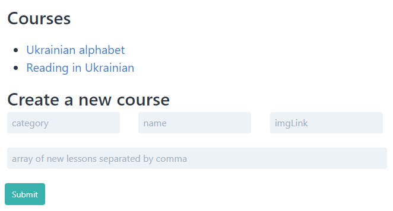

This project was bootstrapped with [Create React App](https://github.com/facebook/create-react-app).

## About
This repo is for editing Firebase content using a Rich Text Editor.

Courses Listing:

Lessons of That Course Listing:

Lesson Editor:

## Configuration
The database credentials are stored in .env 

Only users who are given access to the database (through the Firebase Console) will be able to edit it.

## Firebase reads
If you run a query, you will be charged for any documents returned by that query, not the total number of documents in the collection

## To-do
- [ ] Make a custom component for creating a new course
- [ ] Make a custom component for creating a new lesson 
